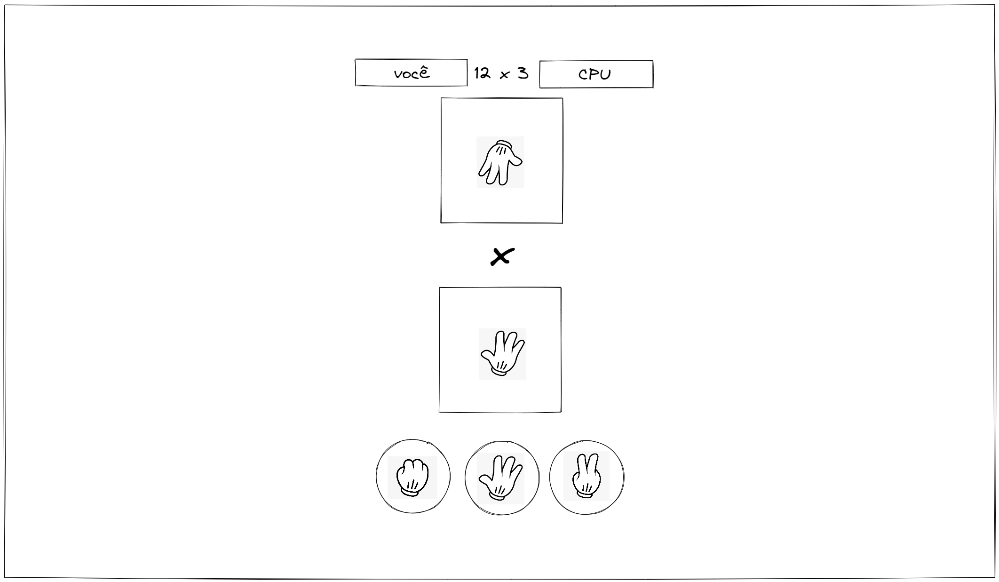

# Pedra, papel e tesoura

## O que você deve fazer?

<strong>⚠️ Obrigatório</strong>

### Requisitos
- A aplicação deve ser feita em HTML, CSS e JavaScript

Para cumprir os requisitos é necessário conhecer ou pesquisar sobre:

- HTML
- CSS
- JavaScript e eventos do DOM
- Manipulação de elementos do DOM

Você pode usar qualquer framework ou biblioteca que desejar, mas é importante que você entenda o que está fazendo.

